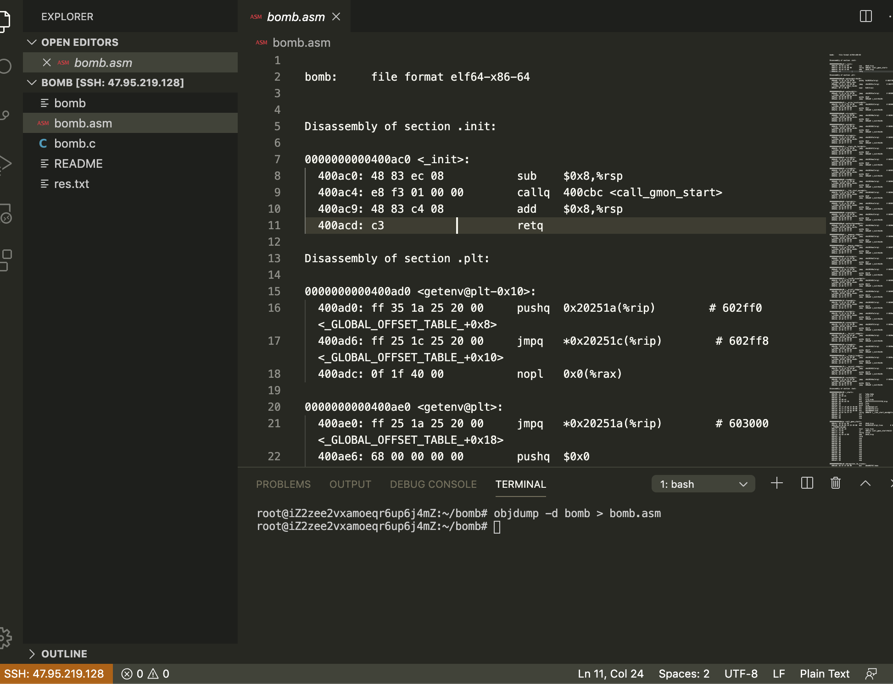
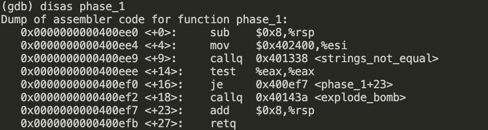
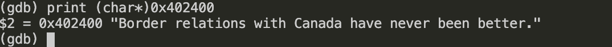
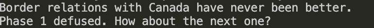

## 实验过程

首先我们需要`objdump -d bomb > bomb.asm`反汇编可执行文件，从而得到汇编代码。如下图所示



为了完成下面的拆弹任务，我们还需要先来看看bomb.c文件

```C
int main(int argc, char *argv[])
{
    char *input;

    /* Note to self: remember to port this bomb to Windows and put a 
     * fantastic GUI on it. */

    /* When run with no arguments, the bomb reads its input lines 
     * from standard input. */
    if (argc == 1) {  
	infile = stdin;
    } 

    /* When run with one argument <file>, the bomb reads from <file> 
     * until EOF, and then switches to standard input. Thus, as you 
     * defuse each phase, you can add its defusing string to <file> and
     * avoid having to retype it. */
    else if (argc == 2) {
	if (!(infile = fopen(argv[1], "r"))) {
	    printf("%s: Error: Couldn't open %s\n", argv[0], argv[1]);
	    exit(8);
	}
    }

    /* You can't call the bomb with more than 1 command line argument. */
    else {
	printf("Usage: %s [<input_file>]\n", argv[0]);
	exit(8);
    }

    /* Do all sorts of secret stuff that makes the bomb harder to defuse. */
    initialize_bomb();

    printf("Welcome to my fiendish little bomb. You have 6 phases with\n");
    printf("which to blow yourself up. Have a nice day!\n");

    /* Hmm...  Six phases must be more secure than one phase! */
    input = read_line();             /* Get input                   */
    phase_1(input);                  /* Run the phase               */
    phase_defused();                 /* Drat!  They figured it out!
				      * Let me know how they did it. */
    printf("Phase 1 defused. How about the next one?\n");

    /* The second phase is harder.  No one will ever figure out
     * how to defuse this... */
    input = read_line();
    phase_2(input);
    phase_defused();
    printf("That's number 2.  Keep going!\n");

    /* I guess this is too easy so far.  Some more complex code will
     * confuse people. */
    input = read_line();
    phase_3(input);
    phase_defused();
    printf("Halfway there!\n");

    /* Oh yeah?  Well, how good is your math?  Try on this saucy problem! */
    input = read_line();
    phase_4(input);
    phase_defused();
    printf("So you got that one.  Try this one.\n");
    
    /* Round and 'round in memory we go, where we stop, the bomb blows! */
    input = read_line();
    phase_5(input);
    phase_defused();
    printf("Good work!  On to the next...\n");

    /* This phase will never be used, since no one will get past the
     * earlier ones.  But just in case, make this one extra hard. */
    input = read_line();
    phase_6(input);
    phase_defused();

    /* Wow, they got it!  But isn't something... missing?  Perhaps
     * something they overlooked?  Mua ha ha ha ha! */
    
    return 0;
}


```


可以看到是可以加上`res.txt`从而避免我们手动输入来验证正确性的逻辑，还有就是我们在测试的时候基本就是输入一条语句，要么正确，要么引爆炸弹所有结束。


### Bomb1
我们现在开始gdb之旅吧！该文件夹下面有gdb的主要操作的pdf，可以参考这个上面的。

好了一切就绪，我们开始吧。

命令行下面输入`gdb bomb`进入gdb调试模式

输入`disas phase_1`来看看一个炸弹到底是什么样



首先我们需要明确一定的是传入的第一个参数存在`%rdi`中，进入`pahse_1` 没有改变，所以当调用`strings_not_equal`函数的时候，第一个参数跟传入`phase_1`的第一个参数是一样的，根据函数名字`strings_not_equal`，我们可以发现是比较字符串的函数，同时第二次参数传入的是指针，保存的是地址，那我们就来看看这个地址的字符串到底是什么呗。

输入`print (char*)0x402400`



je是令标志的时候跳转，那么为了不引发爆炸，`%eax`必须为0，也就是说返回值必须为0=>两个字符串要相等！


我们猜测答案是`Border relations with Canada have never been better.`

输入后果然是正确的。



### Bomb2
我们再来观察`phase_2`

```asm
(gdb) disas phase_2
Dump of assembler code for function phase_2:
   0x0000000000400efc <+0>:     push   %rbp
   0x0000000000400efd <+1>:     push   %rbx
   0x0000000000400efe <+2>:     sub    $0x28,%rsp
   0x0000000000400f02 <+6>:     mov    %rsp,%rsi
   0x0000000000400f05 <+9>:     callq  0x40145c <read_six_numbers>
   0x0000000000400f0a <+14>:    cmpl   $0x1,(%rsp)
   0x0000000000400f0e <+18>:    je     0x400f30 <phase_2+52>
   0x0000000000400f10 <+20>:    callq  0x40143a <explode_bomb>
   0x0000000000400f15 <+25>:    jmp    0x400f30 <phase_2+52>
   0x0000000000400f17 <+27>:    mov    -0x4(%rbx),%eax
   0x0000000000400f1a <+30>:    add    %eax,%eax
   0x0000000000400f1c <+32>:    cmp    %eax,(%rbx)
   0x0000000000400f1e <+34>:    je     0x400f25 <phase_2+41>
   0x0000000000400f20 <+36>:    callq  0x40143a <explode_bomb>
   0x0000000000400f25 <+41>:    add    $0x4,%rbx
   0x0000000000400f29 <+45>:    cmp    %rbp,%rbx
   0x0000000000400f2c <+48>:    jne    0x400f17 <phase_2+27>
   0x0000000000400f2e <+50>:    jmp    0x400f3c <phase_2+64>
   0x0000000000400f30 <+52>:    lea    0x4(%rsp),%rbx
   0x0000000000400f35 <+57>:    lea    0x18(%rsp),%rbp
   0x0000000000400f3a <+62>:    jmp    0x400f17 <phase_2+27>
   0x0000000000400f3c <+64>:    add    $0x28,%rsp
   0x0000000000400f40 <+68>:    pop    %rbx
   0x0000000000400f41 <+69>:    pop    %rbp
   0x0000000000400f42 <+70>:    retq   
End of assembler dump.

```

跟第一问一样，调用`read_six_numbers`函数的第一个参数和传入`phase_2`的第一个参数是一样的，然后把栈的地址当作第二个参数传进去，下面我们来稍微看看函数`read_six_numbers`,


```asm

(gdb) disas read_six_numbers
Dump of assembler code for function read_six_numbers:
   0x000000000040145c <+0>:     sub    $0x18,%rsp
   0x0000000000401460 <+4>:     mov    %rsi,%rdx
   0x0000000000401463 <+7>:     lea    0x4(%rsi),%rcx
   0x0000000000401467 <+11>:    lea    0x14(%rsi),%rax
   0x000000000040146b <+15>:    mov    %rax,0x8(%rsp)
   0x0000000000401470 <+20>:    lea    0x10(%rsi),%rax
   0x0000000000401474 <+24>:    mov    %rax,(%rsp)
   0x0000000000401478 <+28>:    lea    0xc(%rsi),%r9
   0x000000000040147c <+32>:    lea    0x8(%rsi),%r8
   0x0000000000401480 <+36>:    mov    $0x4025c3,%esi
   0x0000000000401485 <+41>:    mov    $0x0,%eax
   0x000000000040148a <+46>:    callq  0x400bf0 <__isoc99_sscanf@plt>
   0x000000000040148f <+51>:    cmp    $0x5,%eax
   0x0000000000401492 <+54>:    jg     0x401499 <read_six_numbers+61>
   0x0000000000401494 <+56>:    callq  0x40143a <explode_bomb>
   0x0000000000401499 <+61>:    add    $0x18,%rsp
   0x000000000040149d <+65>:    retq   
End of assembler dump.
```

从这段代码中我们可以很明显的发现，把栈的地址赋给了`%rdx`（传递参数的第3个参数），把栈地址+4传给了第4个参数，同样的`%r8`和`%r9`都存上了相应的栈地址，这样4个数据的地址都有了。那还剩下两个怎么办呢？用栈呀，至此我们可以得到`sscanf`的格式为

`int sscnaf(char*input,char*,int*,int*,int*,int*,int*,int*)`

第二个char*是一个常量字符串就跟我们的`scanf`一样的`%d`之类的格式。


我们看看调用`sscnaf`这个函数的参数传递情况

|寄存器/地址|n-th参数|内容|
|-|-|-|
|`%rdi`|1|输入的字符串的地址|
|`%rsi`|2|字符串常量的地址|
|`%rdi`|3|phase_2的栈的地址|
|`%rcx`|4|phase_2的栈的地址+4|
|`%r8`|5|phase_2的栈的地址+8|
|`%r9`|6|phase_2的栈的地址+12|
|read_six_numbers的栈地址|7|phase_2的栈的地址+16|
|read_six_numbers的栈地址+4|8|phase_2的栈的地址+20|


搞清楚了这个逻辑之后，我们就可以发现原来输入的数据都存在`phase_2`的栈中，再根据 `phase_2`的代码逻辑可以很快的解码为`1 2 4 8 16 32`


### Bomb3

```asm
(gdb) disas phase_3
Dump of assembler code for function phase_3:
   0x0000000000400f43 <+0>:     sub    $0x18,%rsp
   0x0000000000400f47 <+4>:     lea    0xc(%rsp),%rcx
   0x0000000000400f4c <+9>:     lea    0x8(%rsp),%rdx
   0x0000000000400f51 <+14>:    mov    $0x4025cf,%esi
   0x0000000000400f56 <+19>:    mov    $0x0,%eax
   0x0000000000400f5b <+24>:    callq  0x400bf0 <__isoc99_sscanf@plt>
   0x0000000000400f60 <+29>:    cmp    $0x1,%eax
   0x0000000000400f63 <+32>:    jg     0x400f6a <phase_3+39>
   0x0000000000400f65 <+34>:    callq  0x40143a <explode_bomb>
   0x0000000000400f6a <+39>:    cmpl   $0x7,0x8(%rsp)
   0x0000000000400f6f <+44>:    ja     0x400fad <phase_3+106>
   0x0000000000400f71 <+46>:    mov    0x8(%rsp),%eax
   0x0000000000400f75 <+50>:    jmpq   *0x402470(,%rax,8)
   0x0000000000400f7c <+57>:    mov    $0xcf,%eax
   0x0000000000400f81 <+62>:    jmp    0x400fbe <phase_3+123>
   0x0000000000400f83 <+64>:    mov    $0x2c3,%eax
   0x0000000000400f88 <+69>:    jmp    0x400fbe <phase_3+123>
   0x0000000000400f8a <+71>:    mov    $0x100,%eax
   0x0000000000400f8f <+76>:    jmp    0x400fbe <phase_3+123>
   0x0000000000400f91 <+78>:    mov    $0x185,%eax
   0x0000000000400f96 <+83>:    jmp    0x400fbe <phase_3+123>
   0x0000000000400f98 <+85>:    mov    $0xce,%eax
   0x0000000000400f9d <+90>:    jmp    0x400fbe <phase_3+123>
   0x0000000000400f9f <+92>:    mov    $0x2aa,%eax
   0x0000000000400fa4 <+97>:    jmp    0x400fbe <phase_3+123>
   0x0000000000400fa6 <+99>:    mov    $0x147,%eax
   0x0000000000400fab <+104>:   jmp    0x400fbe <phase_3+123>
   0x0000000000400fad <+106>:   callq  0x40143a <explode_bomb>
   0x0000000000400fb2 <+111>:   mov    $0x0,%eax
   0x0000000000400fb7 <+116>:   jmp    0x400fbe <phase_3+123>
   0x0000000000400fb9 <+118>:   mov    $0x137,%eax
   0x0000000000400fbe <+123>:   cmp    0xc(%rsp),%eax
   0x0000000000400fc2 <+127>:   je     0x400fc9 <phase_3+134>
   0x0000000000400fc4 <+129>:   callq  0x40143a <explode_bomb>
   0x0000000000400fc9 <+134>:   add    $0x18,%rsp
   0x0000000000400fcd <+138>:   retq   
End of assembler dump.
```

老样子，又是调用了 `sscanf`，那我们就看看哪个常量字符串是什么样子的，ok``

```asm
(gdb) print (char*)0x4025cf
$1 = 0x4025cf "%d %d"
```
哈哈，很明显了，需要输入两个数字，接着往上面看一下

```asm
   0x0000000000400f47 <+4>:     lea    0xc(%rsp),%rcx
   0x0000000000400f4c <+9>:     lea    0x8(%rsp),%rdx
```
输入的第一个数字存到了`phase_3`的栈地址+8，第二个数字存到了`phase_3`的栈地址+12，然后我们就来看看逻辑呗，

```asm
   0x0000000000400f6a <+39>:    cmpl   $0x7,0x8(%rsp)
   0x0000000000400f6f <+44>:    ja     0x400fad <phase_3+106>
```
这一句的意思就是第一个数字不能超过7嘛，超过了7就引爆，接着看

```asm
   0x0000000000400f71 <+46>:    mov    0x8(%rsp),%eax
   0x0000000000400f75 <+50>:    jmpq   *0x402470(,%rax,8)
```
这一句话什么意思？跳转地址跟我们的输入有关耶，仔细观察我们可以看到其实只要第一个第一个参数在0-7的范围内都有对应的地址，所以我们取第一个数字为0，发现代码的逻辑为跳转到`*0x402470`


```asm

(gdb) print /x *0x402470
$3 = 0x400f7c
```

所以跳转到地址`0x400f7c`,于是乎可以得到第二个数字为'0xcf'


### Bomb4


```asm

(gdb) disas phase_4
Dump of assembler code for function phase_4:
   0x000000000040100c <+0>:     sub    $0x18,%rsp
   0x0000000000401010 <+4>:     lea    0xc(%rsp),%rcx
   0x0000000000401015 <+9>:     lea    0x8(%rsp),%rdx
   0x000000000040101a <+14>:    mov    $0x4025cf,%esi
   0x000000000040101f <+19>:    mov    $0x0,%eax
   0x0000000000401024 <+24>:    callq  0x400bf0 <__isoc99_sscanf@plt>
   0x0000000000401029 <+29>:    cmp    $0x2,%eax
   0x000000000040102c <+32>:    jne    0x401035 <phase_4+41>
   0x000000000040102e <+34>:    cmpl   $0xe,0x8(%rsp)
   0x0000000000401033 <+39>:    jbe    0x40103a <phase_4+46>
   0x0000000000401035 <+41>:    callq  0x40143a <explode_bomb>
   0x000000000040103a <+46>:    mov    $0xe,%edx
   0x000000000040103f <+51>:    mov    $0x0,%esi
   0x0000000000401044 <+56>:    mov    0x8(%rsp),%edi
   0x0000000000401048 <+60>:    callq  0x400fce <func4>
   0x000000000040104d <+65>:    test   %eax,%eax
   0x000000000040104f <+67>:    jne    0x401058 <phase_4+76>
   0x0000000000401051 <+69>:    cmpl   $0x0,0xc(%rsp)
   0x0000000000401056 <+74>:    je     0x40105d <phase_4+81>
   0x0000000000401058 <+76>:    callq  0x40143a <explode_bomb>
   0x000000000040105d <+81>:    add    $0x18,%rsp
   0x0000000000401061 <+85>:    retq   
End of assembler dump.
```

首先我们来看看需要输入几个数字

```asm
(gdb) print (char*)0x4025cf
$1 = 0x4025cf "%d %d"
```
两个数字，got
再来看逻辑，还是一样的，输入的第一个数字存在`phase_4`的栈地址+8，输入的第二个数字存在`phase_4`的栈地址+12。

```asm
   0x000000000040102e <+34>:    cmpl   $0xe,0x8(%rsp)
   0x0000000000401033 <+39>:    jbe    0x40103a <phase_4+46>
   0x0000000000401035 <+41>:    callq  0x40143a <explode_bomb>
```

首先`JBE`不高于跳转.
这三行不就是说输入的第一个数字不大于14。

下面就开始`func4`

```asm
(gdb) disas func4
Dump of assembler code for function func4:
   0x0000000000400fce <+0>:     sub    $0x8,%rsp
   0x0000000000400fd2 <+4>:     mov    %edx,%eax
   0x0000000000400fd4 <+6>:     sub    %esi,%eax
   0x0000000000400fd6 <+8>:     mov    %eax,%ecx
   0x0000000000400fd8 <+10>:    shr    $0x1f,%ecx
   0x0000000000400fdb <+13>:    add    %ecx,%eax
   0x0000000000400fdd <+15>:    sar    %eax
   0x0000000000400fdf <+17>:    lea    (%rax,%rsi,1),%ecx
   0x0000000000400fe2 <+20>:    cmp    %edi,%ecx
   0x0000000000400fe4 <+22>:    jle    0x400ff2 <func4+36>
   0x0000000000400fe6 <+24>:    lea    -0x1(%rcx),%edx
   0x0000000000400fe9 <+27>:    callq  0x400fce <func4>
   0x0000000000400fee <+32>:    add    %eax,%eax
   0x0000000000400ff0 <+34>:    jmp    0x401007 <func4+57>
   0x0000000000400ff2 <+36>:    mov    $0x0,%eax
   0x0000000000400ff7 <+41>:    cmp    %edi,%ecx
   0x0000000000400ff9 <+43>:    jge    0x401007 <func4+57>
   0x0000000000400ffb <+45>:    lea    0x1(%rcx),%esi
   0x0000000000400ffe <+48>:    callq  0x400fce <func4>
   0x0000000000401003 <+53>:    lea    0x1(%rax,%rax,1),%eax
   0x0000000000401007 <+57>:    add    $0x8,%rsp
   0x000000000040100b <+61>:    retq   
End of assembler dump.
```

观察很容易就可以发现第一个参数为14/2=7，第二个参数为0


### Bomb5

再来观察`phase_5`

```asm
(gdb) disas phase_5
Dump of assembler code for function phase_5:
   0x0000000000401062 <+0>:     push   %rbx
   0x0000000000401063 <+1>:     sub    $0x20,%rsp
   0x0000000000401067 <+5>:     mov    %rdi,%rbx
   0x000000000040106a <+8>:     mov    %fs:0x28,%rax
   0x0000000000401073 <+17>:    mov    %rax,0x18(%rsp)
   0x0000000000401078 <+22>:    xor    %eax,%eax
   0x000000000040107a <+24>:    callq  0x40131b <string_length>
   0x000000000040107f <+29>:    cmp    $0x6,%eax
   0x0000000000401082 <+32>:    je     0x4010d2 <phase_5+112>
   0x0000000000401084 <+34>:    callq  0x40143a <explode_bomb>
   0x0000000000401089 <+39>:    jmp    0x4010d2 <phase_5+112>
   0x000000000040108b <+41>:    movzbl (%rbx,%rax,1),%ecx
   0x000000000040108f <+45>:    mov    %cl,(%rsp)
   0x0000000000401092 <+48>:    mov    (%rsp),%rdx
   0x0000000000401096 <+52>:    and    $0xf,%edx
   0x0000000000401099 <+55>:    movzbl 0x4024b0(%rdx),%edx
   0x00000000004010a0 <+62>:    mov    %dl,0x10(%rsp,%rax,1)
   0x00000000004010a4 <+66>:    add    $0x1,%rax
   0x00000000004010a8 <+70>:    cmp    $0x6,%rax
   0x00000000004010ac <+74>:    jne    0x40108b <phase_5+41>
   0x00000000004010ae <+76>:    movb   $0x0,0x16(%rsp)
   0x00000000004010b3 <+81>:    mov    $0x40245e,%esi
   0x00000000004010b8 <+86>:    lea    0x10(%rsp),%rdi
   0x00000000004010bd <+91>:    callq  0x401338 <strings_not_equal>
   0x00000000004010c2 <+96>:    test   %eax,%eax
   0x00000000004010c4 <+98>:    je     0x4010d9 <phase_5+119>
   0x00000000004010c6 <+100>:   callq  0x40143a <explode_bomb>
   0x00000000004010cb <+105>:   nopl   0x0(%rax,%rax,1)
   0x00000000004010d0 <+110>:   jmp    0x4010d9 <phase_5+119>
   0x00000000004010d2 <+112>:   mov    $0x0,%eax
   0x00000000004010d7 <+117>:   jmp    0x40108b <phase_5+41>
   0x00000000004010d9 <+119>:   mov    0x18(%rsp),%rax
   0x00000000004010de <+124>:   xor    %fs:0x28,%rax
   0x00000000004010e7 <+133>:   je     0x4010ee <phase_5+140>
   0x00000000004010e9 <+135>:   callq  0x400b30 <__stack_chk_fail@plt>
   0x00000000004010ee <+140>:   add    $0x20,%rsp
   0x00000000004010f2 <+144>:   pop    %rbx
   0x00000000004010f3 <+145>:   retq   
End of assembler dump.
```

很容易观察发现输入的字符串的长度为6。
发现又有`string_not_equal`这个函数，先来看看这次的字符串是什么

```asm
(gdb) print (char*)0x40245e
$2 = 0x40245e "flyers"
```

可以很明显的发现参与比较的另一个字符串的地址位`%rsp+10`,那么下面我们就来找`%rsp+10`里面存的什么东西好了

下面解题的关键是理解下面的代码

```asm
   0x000000000040108b <+41>:    movzbl (%rbx,%rax,1),%ecx
   0x000000000040108f <+45>:    mov    %cl,(%rsp)
   0x0000000000401092 <+48>:    mov    (%rsp),%rdx
   0x0000000000401096 <+52>:    and    $0xf,%edx
   0x0000000000401099 <+55>:    movzbl 0x4024b0(%rdx),%edx
   0x00000000004010a0 <+62>:    mov    %dl,0x10(%rsp,%rax,1)
   0x00000000004010a4 <+66>:    add    $0x1,%rax
   0x00000000004010a8 <+70>:    cmp    $0x6,%rax
```

由于`%rbx`里面存放的是输入字符串的地址。所以上面的代码的作用是遍历输入的字符串，然后取后4位作为偏移量，加上0x4024b0,取该地址的字符存放到`%rsp+10+n`的相应位置

```asm
(gdb) print (char*)0x4024b0
$3 = 0x4024b0 <array> "maduiersnfotvbylSo you think you can stop the bomb with ctrl-c, do you?"
```
查ASCII表可以得到`ionefg`


### Bomb6


### Appendix

A（above）大于，B（below）小于，E（equal）等于，用于比较无符号数
G（great）大于，L（less than）小于， E（equal）等于，用于比较带符号数